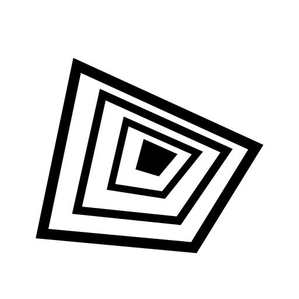

<p align="center">
  
</p>

# CoDes

CoDes is an open-source, cross-platform desktop workspace for running many coding-agent CLIs side by side — Codex CLI, Claude Code, Antigravity CLI, OpenCode, Reasonix (DeepSeek), Grok Build, Qwen Code, Aider, and Pi. It combines real PTY terminals, project dashboards, a task board, telemetry, live preview, encrypted peer sharing, and a live Theme Studio in a compact Codex-inspired interface.

## Current implementation

- Tauri 2 + React 19 + TypeScript desktop application.
- Real cross-platform PTYs via `portable-pty`, binary output channels, input, resize, stop, and provider resume arguments.
- Persistent workspace/project/session/task/theme state in the interface and a WAL-backed SQLite schema for native records and migrations.
- Multi-project workspaces with a bottom-left searchable switcher, custom image identities, recent/activity indicators, drag ordering, archive management, and legacy project-state migration.
- Tabs, split panes, swarm layout, terminal search/links, session status, dashboards, Kanban drag and drop, inspector, alerts, settings, and provider detection.
- Session launch profiles expose interactive approval, workspace auto, read-only plan, and explicit full-access modes, plus optional provider model overrides.
- Task-board Autopilot runs Ready cards as provider-native one-shot jobs, respects per-task provider/mode/model settings and a configurable parallel-worker limit, then moves cards to Done only after a successful process exit.
- Registry-driven provider adapters: each agent CLI is one entry in `src-tauri/src/lib.rs` (launch/resume/detection) plus one entry in `src/lib/providers.ts` (label, icon, color, install, docs).
- Cross-provider handoff previews import structured Codex, Claude, OpenCode, Grok, and Pi conversations when available, with a bounded CoDes terminal capture for other providers. Users choose conversation-only, full-visible, or recent context before it is sent.
- Isolated Tauri child-webview adapter plus safe iframe fallback for browser preview and same-origin element capture.
- Versioned AES-GCM encrypted WebRTC signaling protocol with permission-aware terminal channels.
- Self-hostable, memory-only WebSocket relay with expiry, payload limits, validation, and rate limiting.
- Live theme editing, duplication, JSON import/export, density/radius/type scaling, and bundled open-source fonts.

## Development

Requirements: Node.js 24+, Rust stable, platform-specific [Tauri prerequisites](https://v2.tauri.app/start/prerequisites/), and at least one authenticated agent CLI.

Provider setup: each provider reuses your existing CLI install and authentication — CoDes never stores provider credentials. Install whichever agent CLIs you want and CoDes detects them automatically:

| Provider | Binary | Install |
| --- | --- | --- |
| Codex | `codex` | [docs](https://learn.chatgpt.com/docs) |
| Claude Code | `claude` | [docs](https://docs.anthropic.com) |
| Antigravity | `agy` | [install](https://antigravity.google/product/antigravity-cli) (launched via its `agy` binary) |
| OpenCode | `opencode` | `npm i -g opencode-ai` · [docs](https://opencode.ai/docs/) |
| Reasonix (DeepSeek) | `reasonix` | `npm i -g reasonix` · [repo](https://github.com/esengine/DeepSeek-Reasonix) |
| Grok Build | `grok` | `curl -fsSL https://x.ai/cli/install.sh \| sh` · [docs](https://docs.x.ai/build/overview) |
| Qwen Code | `qwen` | `npm i -g @qwen-code/qwen-code` · [repo](https://github.com/QwenLM/qwen-code) |
| Aider | `aider` | `pipx install aider-chat` · [docs](https://aider.chat) |
| Pi | `pi` | `npm i -g @earendil-works/pi-coding-agent` · [docs](https://pi.dev) |

```sh
npm install
npm run tauri dev
```

The development command starts both Vite and the local signaling relay. To run only the relay separately:

On Windows, the npm Tauri launcher stops only stale CoDes debug instances, uses `src-tauri/.dev-target` to avoid locks from normal Cargo builds, and shuts down the Vite/signaling process trees together when development stops.

```sh
npm run relay:dev
```

Quality gates:

```sh
npm run check
npm test
npm run check --workspace @codes/signaling
npm run build --workspace @codes/signaling
cargo test --manifest-path src-tauri/Cargo.toml
npm run build
```

## Security boundaries

- Provider credentials remain owned by their CLIs.
- Provider history files are read-only inputs. Handoff previews exclude hidden/system records, redact likely credentials by default, and clearly report unavailable, ambiguous, malformed, or permission-denied history instead of guessing.
- Remote pages are loaded in isolated webviews without a general application IPC bridge.
- Session invites use random room secrets; signaling content is encrypted before reaching the relay.
- Remote terminal input is rejected until the host grants write permission.
- Full access is intentionally explicit: it maps to each provider's supported bypass flag and should only be used in a trusted or externally sandboxed workspace.
- The relay stores no rooms or messages on disk and expires inactive invitations.

The updater plugin is intentionally disabled in development. Before enabling it for production, configure the Tauri updater public key and endpoint, register `tauri-plugin-updater` in the Rust builder, grant its capability, enable `bundle.createUpdaterArtifacts`, and add the GitHub release signing key, Windows signing certificate, and Apple signing/notarization secrets used by `.github/workflows/release.yml`. CoDes deliberately does not ship with a generated or placeholder signing identity.

## Architecture

```text
React workspace ── typed Tauri commands/channels ── Rust core
      │                                            ├─ PTY session manager
      │                                            ├─ SQLite migrations
      │                                            └─ provider diagnostics
      ├─ xterm.js terminals
      ├─ child-webview browser adapter
      └─ encrypted WebRTC peer ── opaque WS relay ── peer
```

## Feature acceptance matrix

| Capability | Implementation | Verification |
| --- | --- | --- |
| Project dashboard and widgets | Responsive overview, readiness, sessions, task flow, GitHub pulse, actions | UI build and visual smoke |
| Multi-project workspaces | Searchable switcher, local image icons, project moving, ordering, duplication, archive/delete safeguards | Store/icon tests and responsive visual smoke |
| Kanban | Persistent tasks, tags, four columns, drag/drop, linked-session state | Typecheck and interaction smoke |
| Multi-session PTY | Tabs, split, swarm, binary streaming, input, resize, stop | Rust compile plus native smoke |
| Provider support | Codex, Claude, Antigravity, OpenCode, Reasonix, Grok, Qwen, Aider, Pi detection/start/resume adapters | Installed CLI matrix |
| Session telemetry | Normalized status model, timeline, truthful optional cost/context | Fixture tests to be expanded per CLI release |
| Browser preview | Isolated child webview and same-origin inspector fallback | Native engine matrix |
| Live sharing | AES-GCM signaling, WebRTC data channel, host write gate, expiring relay | Protocol tests and two-peer smoke |
| Theme Studio | Semantic tokens, presets, live editing, duplication, import/export | Typecheck and visual regression |
| Packaging | Windows, macOS, Linux CI and signed release workflow | CI matrix |

CoDes is an independent project and is not affiliated with OpenAI, Anthropic, Google, xAI, DeepSeek, Alibaba, Earendil, or Vibeyard.

## Contributing

Contributions are welcome. Read [CONTRIBUTING.md](CONTRIBUTING.md) before opening a pull request. Please report security issues privately using the process in [SECURITY.md](SECURITY.md).

## License

CoDes is available under the [MIT License](LICENSE).
