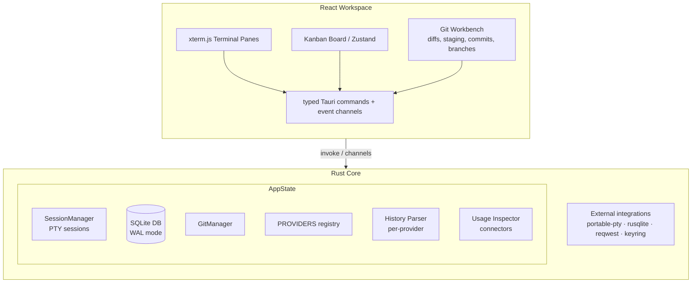
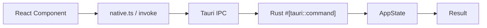
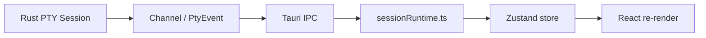
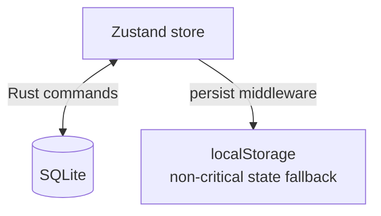

# Architecture

CoDes is a Tauri 2 desktop application with a React/TypeScript frontend and a Rust backend.

## High-Level Data Flow

## Process Model

CoDes runs as a single desktop process with two main threads:

1. **Main/Renderer thread** — React frontend in a Tauri webview
   - UI rendering, user interaction, state management (Zustand)
   - Runs xterm.js terminals, Kanban board, Git UI, etc.
   - Communicates with Rust via typed Tauri commands and event channels

2. **Rust backend thread** — Tauri Rust core
   - PTY session management (spawn, resize, write, stop)
   - SQLite database operations
   - Git operations
   - Provider detection and diagnostics
   - History parsing
   - Usage data collection

Additional resources:
- **Child PTY processes** — each session spawns a child process via `portable-pty`
- **Child webview** — browser preview runs in a separate Tauri webview process
- **WebSocket connection** — signaling relay connection for sharing (separate TCP connection)
- **WebRTC** — peer-to-peer data channels for sharing (separate UDP connections)

## Component Architecture

### Rust Backend (`src-tauri/src/`)

| Module | Responsibility | Key Types |
|---|---|---|
| `lib.rs` | Application entry, Tauri commands, AppState, SessionManager, SQLite schema, PROVIDERS registry | `AppState`, `SessionManager`, `SessionHandle`, `SharedChild` |
| `git_manager.rs` | Git workbench: diffs, staging, commits, branches, PRs | `GitManager` |
| `history.rs` | Provider conversation history parsing | Per-provider parser functions |
| `usage.rs` | Token/cost evidence collection and API connectors | Connector implementations |
| `main.rs` | Binary entry point, calls `codes_lib::run()` | — |

### TypeScript Frontend (`src/`)

| Module | Responsibility |
|---|---|
| `App.tsx` | Root component, workspace layout, drag-and-drop, deep links |
| `App.css` | Global styles, CSS custom properties from active theme |
| `store.ts` | Zustand store: workspace, projects, sessions, tasks, themes, UI |
| `types.ts` | TypeScript interfaces matching the data model |
| `lib/native.ts` | Tauri IPC wrappers (typed `invoke` and `listen` calls) |
| `lib/providers.ts` | Provider UI metadata (label, icon, color) |
| `lib/sessionRuntime.ts` | Runtime session state management, event listeners |
| `lib/workflowAutomation.ts` | Multi-CLI workflow execution engine |
| `lib/workflowModel.ts` | Workflow template normalization and expansion |
| `lib/taskAutomation.ts` | Autopilot task execution |
| `lib/dialogs.ts` | Dialog orchestration |
| `lib/handoff.ts` | Session handoff logic |
| `lib/persistence.ts` | State persistence helpers |
| `components/` | React components: terminals, Git UI, Kanban, etc. |
| `sharing/` | Encrypted WebRTC sharing client and protocol |

## Data Flow Patterns

### Command Flow (Frontend → Backend)

### Event Flow (Backend → Frontend)

### State Persistence

## Key Design Decisions

1. **SQLite with WAL mode** — enables concurrent reads during writes; migrations are version-tracked in a `schema_migrations` table
2. **Registry-driven providers** — adding a new provider is one Rust entry + one TypeScript entry; no framework changes needed
3. **OS credential vault for secrets** — API keys and tokens are stored via `keyring`, never in config files or SQLite
4. **Isolated webview for browser preview** — prevents remote pages from accessing CoDes internals
5. **AES-GCM encryption for sharing** — session data is encrypted before reaching the signaling relay; the relay is opaque

## See Also

- [Source Layout](source-layout.md) — annotated directory tree
- [Rust Backend](rust-backend.md) — deep dive into the Rust core
- [Frontend](frontend.md) — React/Zustand architecture
- [Database Schema](database-schema.md) — SQLite table definitions
- [IPC Commands](ipc-commands.md) — Tauri command reference
