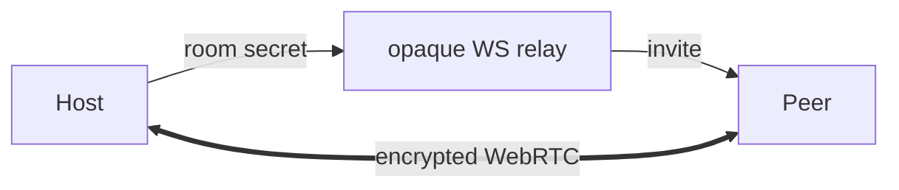

# Live Sharing

CoDes supports live, encrypted peer sharing of sessions via WebRTC data channels.

## Overview

Sharing lets you invite another CoDes user to view (or interact with) your session in real time. The connection is:
- **Encrypted** — AES-GCM encrypted WebRTC data channel
- **Peer-to-peer** — media flows directly between peers after signaling
- **Permission-aware** — the host controls whether the peer can view only or also send input

## How It Works



1. The host creates a **room** with a random secret via the signaling relay
2. An **invite** (opaque room token) is sent to the peer out of band
3. The peer joins via the relay using the token
4. WebRTC negotiation happens through the relay
5. A direct encrypted data channel opens between host and peer
6. Terminal output streams to the peer; input flows back only if the host grants write permission

## Setting Up Sharing

### Starting a Share

1. Open the session you want to share
2. Click the **Share** button in the session toolbar
3. CoDes creates a room and shows the invite token
4. Send the invite token to your peer via a secure channel (the relay doesn't store it)

### Joining a Shared Session

1. The peer opens CoDes and navigates to **Sharing → Join**
2. Pastes the invite token
3. The connection establishes automatically

### Permissions

| Permission | Peer Can |
|---|---|
| **View** | See terminal output in real time |
| **Write** | Type into the terminal (disabled by default) |

The host can toggle write permission at any time during the session.

## Signaling Relay

The WebSocket relay facilitates initial connection negotiation. It:
- Is **memory-only** — no persistence to disk
- Has **expiry** — rooms expire after inactivity
- **Rate-limited** — prevents abuse
- **Validates payloads** — drops malformed messages
- Stores **no rooms or messages** on disk

### Self-Hosted Relay

You can run your own relay for privacy or network control:

```sh
cd services/signaling
npm install
npm run build
npm start
```

Or use Docker:

```sh
cd services/signaling
docker build -t codes-signaling .
docker run -p 3000:3000 codes-signaling
```

The relay configuration includes:
- **Port** (default: 3000)
- **Rate limit** (max messages per second)
- **Room expiry** (TTL in seconds)

## Security

- Room secrets are random and generated by CoDes
- Signaling content is encrypted **before** reaching the relay — the relay never sees session data
- The relay stores no rooms or messages on disk
- Remote terminal input is rejected until the host explicitly grants write permission
- Invitations expire after the room TTL

## See Also

- [Sessions](sessions.md) — what gets shared
- [Signaling Relay](../dev/signaling-relay.md) — developer docs for the relay
- [Security Model](../ref/security-model.md) — detailed security boundaries
